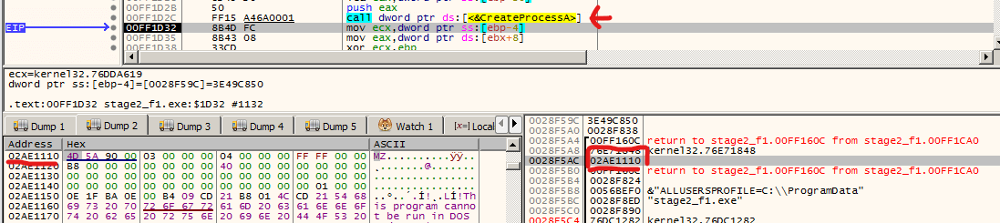
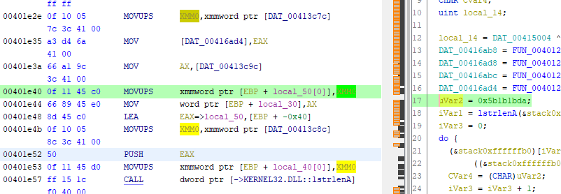

# Zero 2 Auto Practical

An attempt to solve practicals from Zero2Auto course.

## Practical 3: Custom Sample 1

(TODO: publish this post in [my blog][blog])

Source: [Zero2Auto Practical 3][p3]

```text
a0ac02a1e6c908b90173e86c3e321f2bab082ed45236503a21eb7d984de10611  main_bin.exe

# Unpacked payloads
a4997fbff9bf2ebfee03b9373655a45d4ec3b1bcee6a05784fe4e022e471e8e7  stage2.exe
a84b6fa193bd8d17065907744354333f0d0240a0498a4c6fdef75e3ac9620606  stage3.exe
```

### Stage 1 unpack

Unpack by setup break point on `VirtualAlloc` and `VirtualProtect`.

Once `VirtualProtect` has hit, extract binary blob from last `VirtualAlloc` call.

### Stage 2 unpack

Some anti-analysis in this stage:

- API hashing was added for this payload. You can find [pre-hashed documents online][api_hash].
- There're also anti-debug measures in place:
  - current executable name must be `svchost.exe`;
  - It checks the result of `IsDebuggerPresent`;
  - It checks for crc32 of running process names:

    ```text
    0x7c6ffe70 - processhacker.exe
    0x47742a22 - wireshark.exe
    0xd2f05b7d - x32dbg.exe
    0x659b537e - x64dbg.exe
    ```

- Anti debug can be patched out all together, see `patches/stage2.1337`.

Easily dump-able:

- Set break point on `CreateProcessInternalW`
- Once hit, return to user-space, then exam the stack for executable headers.



Regarding static analysis of this file, IDA is recommanded (though not ideal).
Ghidra misses inlined `memcpy` badly:



[api_hash]: https://github.com/tildedennis/malware/blob/master/phasebot/api_hashes

### Static unpacker

1. Extract resource from executable and decrypt;
   - RC4; key is embedded within the resource.
2. Follow the URL, extract & decrypt data;
   - Iterate the data section to identify next payload url.
   - Decrypted using a static key,
     could also detect xor key using known plain text header.
3. Save final payload.

To give the static unpacker a try:

```sh
# get the next payload:
python practical3/stage1.py main_bin.exe stage2.exe
python practical3/stage2.py stage2.exe stage3.exe

# or, get stage3 payload in one go:
python -m practical3 main_bin.exe stage3.exe
```

[blog]: https://jixun.uk/
[p3]: https://courses.zero2auto.com/adv-malware-analysis-course#:~:text=Custom%20Sample%20README-,Custom%20Sample%201,-129%20KB
